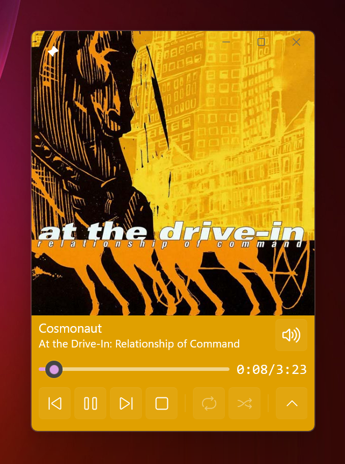
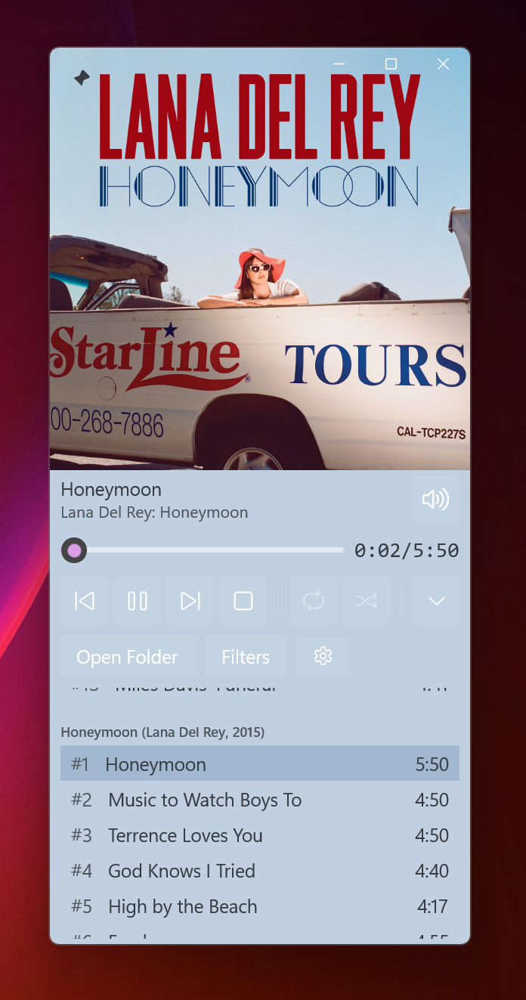
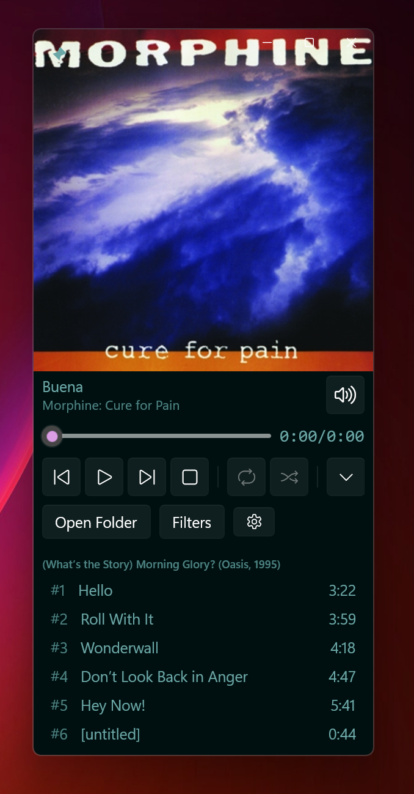

# Discosaur

This is a Windows Desktop application built with the WinUI3 framework to play music. It is aimed to be used to listen to entire albums -- you select a folder with the tracks with correct metadata and a cover art. The application itself has a dynamic theme built-in, so the artwork is very important. You can pin the application to keep it on top of all other apps, and you can also collapse the playlist.

## Examples

You can see the dynamic theme in action, as it adapts to the artwork:

## Technologies used

- [NAudio](https://github.com/naudio/NAudio) for audio playback
- [TagLib#](https://github.com/mono/taglib-sharp) for metadata fetching

It uses native Windows decoding, so it should support WAV, FLAC, MP3, OGG, etc; I only tested in on FLAC albums ripped using my [audio-cd-ripper](https://github.com/Bloomca/audio-cd-ripper) tool.

## Download

Currently, you can only build it from the source, once I go through the core features, I'll publish it to the MS Store.